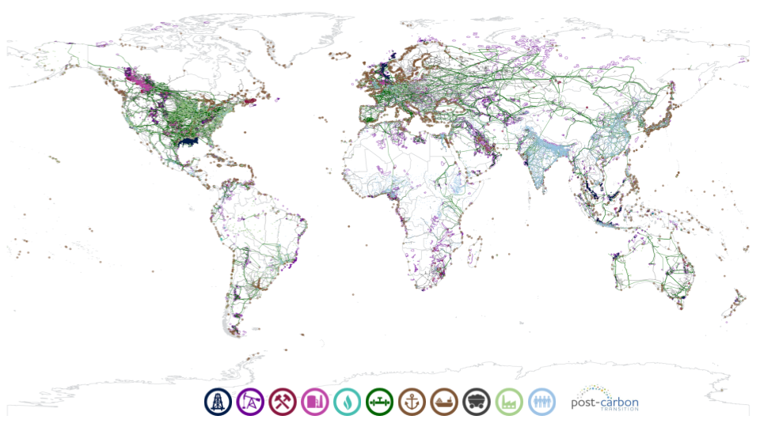

# Global Fossil Fuel Supply Chain

A repo for building a network implementation of the global fossil fuel supply chain using asset level data. A project in support of the [Oxford Martin Programme on the Post-Carbon Transition](https://www.oxfordmartin.ox.ac.uk/post-carbon/).

## Research Applications
The energy system is inherently spatial. Spatially localised energy demand is increasingly met with intermittent, spatially localised energy supply. Energy infrastructure is path-depends and creates technology- and greenhouse-gas emissions lock-in. Understanding the spatial layout of conventional energy infrastructure, and geographies of resource supply and demand is critical for designing efficient and robust pathways to net-zero carbon emissions.

This repo takes raw data and constructs it into a graph which can be interrogated with network analysis. Research questions will then follow:
- How might we identify geospatial sensitive intervention points in the fossil fuel supply chain?
- What is the most efficient way to decarbonise: extremities first (savings in the parasitic emission of infrastructure), or central core first (i.e. strand the extremities)?
- Can we find robust pathways to a carbon-free energy system? What about strategies robust to the interdiction of an industry that continues to build?
- Is the data and model prescient? Can we fit it to historic emissions or pricing data?

## Repo Structure

/globalenergydemand contains scripts for calculating and allocating global energy demand:
- [degreedays.py](globalenergydemand/degreedays.py) - contains a class for calculating heating and cooling degree day baselines for anywhere in the world
- [euclideanallocation.py](globalenergydemand/euclideanallocation.py) - contains a class for the spatial allocation of any country's land mass to urban population centers in that country, creating representative population clusters for any country.
- [energyallocation.py](globalenergydemand/energyallocation.py) - contains a class for energy allocation (coal, oil, and natural gas) to any population clusters created in the euclidean allocaiton
- [vincenty_py3](globalenergydemand/vincenty_py.py) - some simple vincenty and vincenty_inverse functions for forward and backwards vincenty calculations.

## Data

Data must be [downloaded](https://drive.google.com/file/d/1LWXT3WyNpMS8xmdFzStbUyQlzdPLGhv_/view?usp=sharing) and unzipped in a folder `data` in the main directory.

## To Do

Lots!

