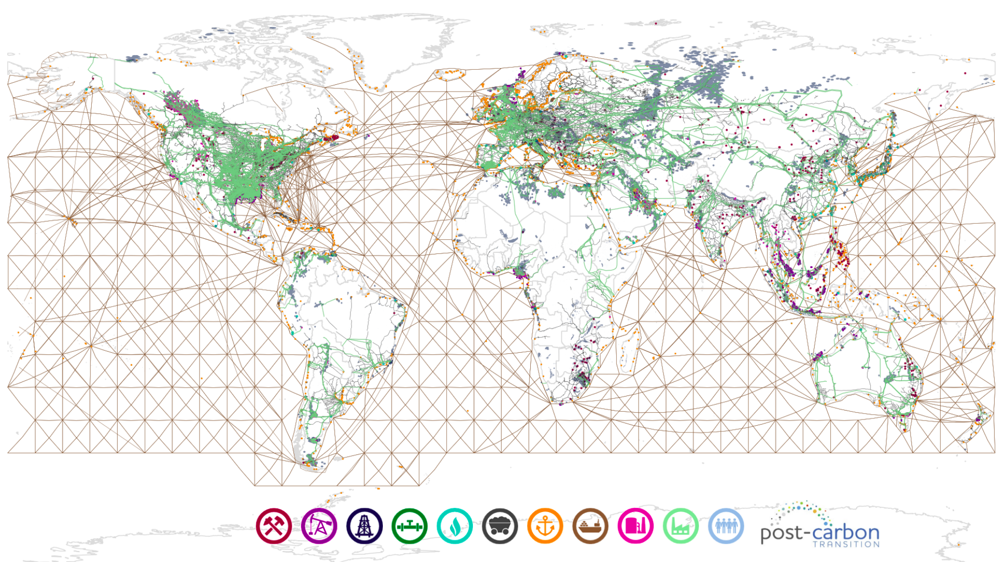
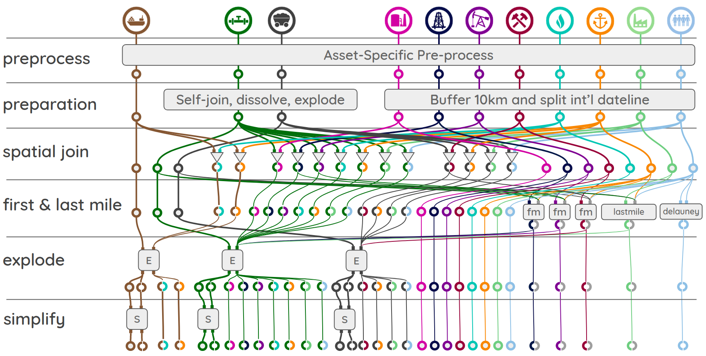

# Asset-level Transition Risk in the Global Coal, Oil, and Gas Supply Chains

**Kruitwagen, L., Klaas, J., Baghaei Lakeh, A., & Fan, J.**

A repo for building a network model of the global fossil fuel supply chain using asset-level data. A project in support of the [Oxford Martin Programme on the Post-Carbon Transition](https://www.oxfordmartin.ox.ac.uk/post-carbon/) generously supported by [QuantumBlack, a McKinsey company](https://www.quantumblack.com/) and [Microsoft AI for Earth](https://www.microsoft.com/en-us/ai/ai-for-earth).

## Abstract

Climate change risks manifest in the real economy, with grave consequences for welfare of human populations and the biosphere; the economic returns of industrial sectors; and geopolitical stability. Understanding the diffusion of risks in real infrastructure networks is an urgent priority for delivering climate change mitigation, adaptation, and resiliency. The oil, gas, and coal supply chains are the most salient progenitors and inheritors of these environmental risks.
We prepare a geospatial arrangement of the global oil, gas, and coal supply chains using open-source asset-level data. The resulting complex network has 6.09mn nodes and 15.70mn edges and is implemented in a graph database. With estimates of annual coal, gas, and oil demand in 13,229 global population centres and 8,165 global power stations, we use a minimum-cost flow method to estimate global asset-level energy flows. We develop a method for cross-validating and tuning our network flow simulation using aggregate country-level import and export statistics. We demonstrate two analyses of asset-level transition risk: a counter-factual demand shock scenario consistent with the IEA Sustainable Development Scenario; and supply shock scenarios developed by interdicting regionally-aggregated coal, oil, and gas supplies. Our contribution lies in the global scope of our asset-level supply chain and the novelty of our minimum-cost flow method. We conclude with a discussion of further research directions and make the graph database and supporting code publicly available.

The full paper is available here: [].

**Figure 1: Global coal, oil, and gas asset-level data**

## Data

Our work uses only open-source data in order to maximise accessibility and reporduceability. We build on the substantial efforts of public sector organisations to develop and publish open datasets of energy system infrastrucutre and activity, particularly the work of the Global Energy Monitor, the World Resources Institute ResourceWatch, the Global Oil and Gas Features Database, the European Commision Joint Research Council, OpenStreetMap.

| Name                              | N_installations | N_sources  | Quality    |                            Icon    |
| --------------------------------- | ---------------:| ----------:|:----------:| ----------------------------------:|
| Well Pads                         | 9,845           |         24 | Good       |       |
| Oil Fields                        | 25,236          |         63 | Good       |      |
| Coal Mines                        | 3,099           |         32 | Adequate   |      |
| Processing & Refining Facilities  | 2,501           |         55 | Good       |      |
| LNG Liqufication & Regasification | 329             |         15 | Excellent  |   | 
| Pipelines                         | 94,448          |         82 | Good       |      |
| Ports                             | 3,702           |         10 | Excellent  |          |
| Shipping Routes                   | 8,273           |          1 | Excellent  | |
| Railways                          | 496,808         |         52 | Excellent  |       |
| Power Stations                    | 28,664          |          1 | Good       |  |
| Population Centres                | 13,229          |          2 | Excellent  |          |

Data must be [downloaded](https://drive.google.com/file/d/1LWXT3WyNpMS8xmdFzStbUyQlzdPLGhv_/view?usp=sharing) and unzipped in a folder `data/` in the main directory.

## Setup

#### Environment

On a fresh linux install you will require the following:

    sudo apt-get install python3-dev build-essential libspatialindex-dev openjdk-8-jre

We use [conda](https://docs.conda.io/en/latest/miniconda.html) for environment management. Create a new environment:

    conda create -n ffsc python=3.7

Activate your conda environment:

    conda activate ffsc

Clone and change directory into this repo:

    git clone https://github.com/Lkruitwagen/global-fossil-fuel-supply-chain.git
    cd global-fossil-fuel-supply-chain

Install pip package manager to the environment if it isn't already:

    conda install pip

Install the project packages. Conda is used to install geospatial packages with c binary dependancies:

    pip install -r requirements.txt
    conda install -c conda-forge --file conda_reqs.txt

#### Environment Variables

Save the environment variables we need in activation and deactivation scripts in the conda environment. Follow the [conda instructions](https://docs.conda.io/projects/conda/en/latest/user-guide/tasks/manage-environments.html#setting-environment-variables) for your os, and adapt the following:

    cd CONDA_PREFIX
    mkdir -p ./etc/conda/activate.d
    mkdir -p ./etc/conda/deactivate.d
    touch ./etc/conda/activate.d/env_vars.sh
    touch ./etc/conda/deactivate.d/env_vars.sh

edit `./etc/conda/activate.d/env_vars.sh` as follows:

    #!/bin/sh
    export USE_PYGEOS=1
    export PYTHONPATH=$PWD
    export NUMEXPR_MAX_THREADS=24 # or something suiting your resources

edit `./etc/conda/deactivate.d/env_vars.sh` as follows:

    #!/bin/sh

    unset PYTHONPATH
    unset USE_PYGEOS
    unset NUMEXPR_MAX_THREADS

Save and close both files.

#### Community Detection

Clone [the DirectedLouvain repository](https://github.com/nicolasdugue/DirectedLouvain)

    git clone https://github.com/nicolasdugue/DirectedLouvain.git
    
Enter the repository and run the MakeFile

    cd DirectedLouvain
    make

#### PyPy

We use [PyPy](https://www.pypy.org/index.html) to significantly speed-up dijkstra minimum-cost path search. PyPy uses a just-in-time compiler to significantly speed-up Python code execution. [Download](https://www.pypy.org/download.html) the correct version of PyPy to `bin/`.

#### (Optional) Neo4J Database
1. Note if ssh tunnelling you will need to redirect port 8678 and 8888
1. [Install neo4j server](https://neo4j.com/docs/operations-manual/current/installation/linux/). We use Neo4j 3.5 in our experiments, 
but everything described here should also work with Neo4j 4.0

## Useage 

### Running the computational pipeline

The main pipeline entrypoint is `cli.py`. The commands available to `cli.py` can be found with:

    python cli.py --help

The following top-level commands are available: `network-assembly`,`solve-flow`,`shock-analysis`, and `visualisation`. 

The pipeline makes extensive use of [Kedro](https://kedro.readthedocs.io/en/stable/), which is a computational graph manager. Kedro uses of a data catalog, which is here: [conf/base/catalog.yml](conf/base/catalog.yml). The catalog can also be used in other scripts and environments:

    from kedro.io import DataCatalog
    import yaml

    catalog = DataCatalog(yaml.load(open('/path/to/conf/base/catalog.yaml','r'),Loader=yaml.SafeLoader))
    dataframe = catalog.load('<dataframe-key>')

Each pipeline is a computational graph with computation nodes and dataset edges, creating a version-controlled reproduceable workflow from raw data through to analysis. Computation nodes are labelled with *tags* so the pipeline can be run one-node-at-a-time, if desired. The computational graph for the `network-assembly` pipeline is shown in the figure below. Each pipeline can be run using:

    python cli.py <pipeline-command> --tags=<list,of,comma-separated,tags>

Tags are nested such that top-level tags will execute a while pipeline step, and nested tags will execute substeps for certain asset types or energy carriers.

**Figure A-1: Network assembly computational graph**

### Assembling the infrastructure network

This pipeline assembles the asset-level infrastructure network. It can be run with `python cli.py network-assembly`. A comma-separated list of `--tags` can also be passed. Passing `--help` produces the following documentation:

    Usage: cli.py network-assembly [OPTIONS]

    Assemble the basic network from asset-level data. See
    ffsc.pipeline.pipeline.py for detailed tags.

    AVAILABLE TOP-LEVEL TAGS:
    -------------------------
    --preprocess : Preprocessing and homogenisation of all raw asset data.
    --prep       : Geospatial preparation operations on all data.
    --sjoin      : Spatial join operations matching linear and point assets.
    --flmile     : First- and last-mile matching operations to gapfill missing data.
    --explode    : Geospatial post-processing of joining and matching.
    --simplify   : Simplification operations to reduce the number of nodes.

    Options:
    --tags TEXT  Optionally specify any individual node tags you want to run in
               a comma-separated list.

    --help       Show this message and exit.

### Solving energy flow on the network

This pipeline calculates asset-level energy flow through the network, from energy sources (i.e. coalmines, and oil and gas fields and wells) through to energy sinks (population centres and powerstations). It can be run with `python cli.py solve-flow`. A comma-separated list of `--tags` can also be passed. Passing `--help` produces the following documentation:

    Usage: cli.py solve-flow [OPTIONS]

    Assemble the basic network from asset-level data. See
    ffsc.flow.flow_pipeline.py, ffsc.communities.community_pipeline.py, and
    ffsc.interdiction.interdiction_pipeline.py for detailed tags.

    AVAILABLE TOP-LEVEL TAGS:
    -------------------------
    --flow_edges           : Prepare network edges dataframe.
    --flow_nodes           : Prepare network nodes dataframe.
    --flow_nx              : Test network connectivity and prepared for flow calculations.
    --community-prep       : Prepare to add communities to network.
    --community-run        : Run community detection algorithm.
    --community-post-nodes : Post-process community detection onto node dataframe.
    --community-post-edges : Post-process community detection onto edge dataframe.
    --dijkstra-pickle      : Pickle edges in preparation for dijkstra mincost path.
    --dijkstra-paths       : Run async dijkstra mincost path.
    --dijkstra-adj         : Post-process dijkstra to mincost adjacency matrix.
    --dijkstra-flow        : Solve flow using iterative cost-scaling.

    Options:
    --tags TEXT  Optionally specify any individual node tags you want to run
    --help       Show this message and exit.

### Analysing demand and supply shocks

The energy infrastructure network can be treated with demand and supply shocks. Flow can be recalculated to see the effect of the shocks on asset-level energy flow and costs. The pipeline can be run with `python cli.py shock-analysis`. A comma-separated list of `--tags` can also be passed. Passing `--help` produces the following documentation:

    Usage: cli.py shock-analysis [OPTIONS]

    Prepare demand and supply shock analysis. See
    ffsc.interdiction.interdiction_pipeline.py for detailed tags.

    AVAILABLE TOP-LEVEL TAGS:
    -------------------------
    --sds_counterfactual       : Prepare Sustainable Development Scenario demand shock analysis.
    --supply-interdiction      : Prepare supply interdiction shock analysis.
    --post-supply-interdiction : Post-process supply interdiction shock analysis.

    Options:
    --tags TEXT  Optionally specify any individual node tags you want to run
    --help       Show this message and exit.

### Visualising the data, flow, and analysis

The asset-level data can be visualised on a world map, and scaled and colored by the amount of energy flow passing through each asset. The pipeline can be run with `python cli.py visualisation`. A comma-separated list of `--tags` can also be passed. Passing `--help` produces the following documentation:

    Usage: cli.py visualisation [OPTIONS]

    Prepare visualisation of assets, flow, and demand shock counterfactual.
    See ffsc.visualisation.visualise_pipeline.py for detailed tags.

    AVAILABLE TOP-LEVEL TAGS:
    -------------------------
    --visualise-assets      : Visualise all assets.
    --visualise-iso2        : Add iso2 country codes to dataframes.
    --visualise-trade-prep  : Prepare trade dataframes for comparison.
    --visualise-trade       : Visualise actual trade and production vs simulated.
    --visualise-flow        : Visualise energy flow.
    --compare-flow          : Compare energy flow to SDS demand shock energy flow.

    Options:
    --tags TEXT  Optionally specify any individual node tags you want to run
    --help       Show this message and exit.

### Importing files into Neo4j
1. Make sure Neo4j is shut down. The installer might start up neo4j under a different user (e.g. Neo4j). 
In this case, you might want to find the process under which Neo4j runs using `sudo ps -a | grep neo4j`. Find the PID of the process and kill it using `sudo kill`.
2. As Neo4j's files may be restricted, you want to do the next steps as root.
3. Delete Neo4j's data folder from the old database. On Linux, this is stored under `/var/lib/neo4j/data`.
4. Import the data by executing the `bin/import.sh` script, which you can find under `src/neo4j_commands` in this repository.
5. After the import is complete, restart Neo4j using `neo4j start`

